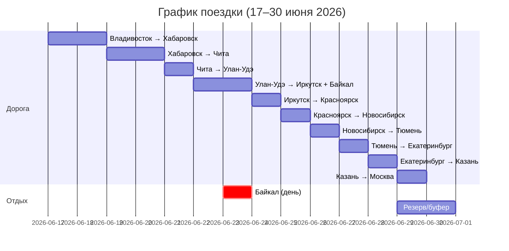
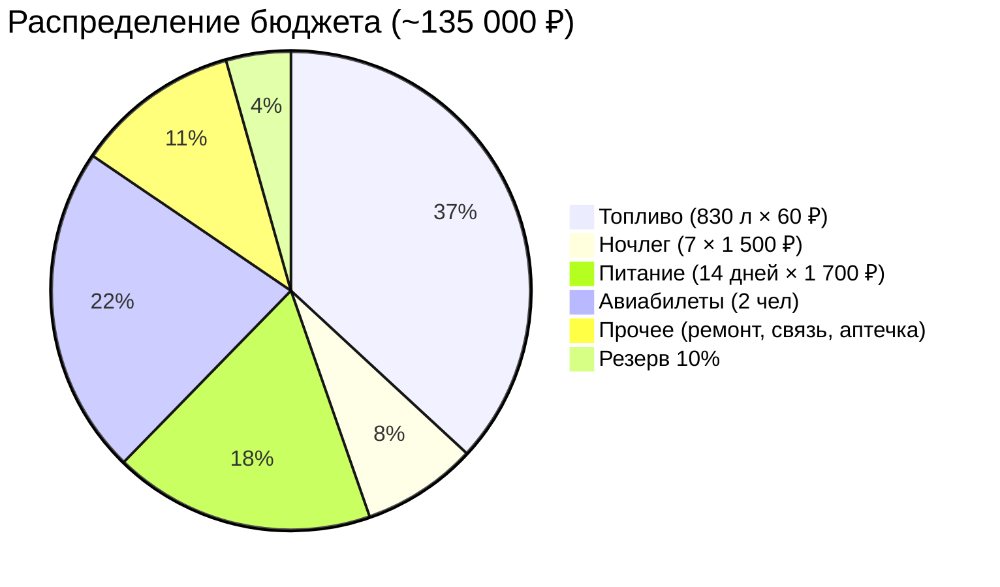
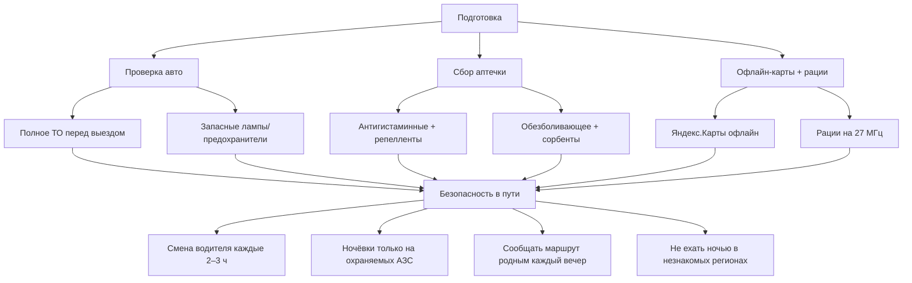
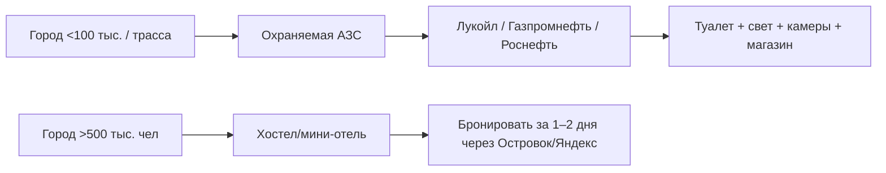
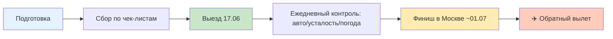

# 🚗 Автопутешествие: Владивосток → Москва  
## Эконом-план для двоих на Honda Freed 2017  
*Дата старта: ~17 июня 2026 | Длительность: 14–16 дней | Бюджет: ~110–160 тыс. ₽*

> 📋 **Сохраните этот файл как `Vladivostok-Moscow_Plan.md` и поделитесь с друзьями.**

---

## 📊 Краткая сводка

| Параметр | Значение | Примечание |
|----------|----------|------------|
| **Маршрут** | Владивосток → Москва | ~9 200 км по трассам |
| **Даты** | ~17–30 июня 2026 | +1–2 дня запаса |
| **Участники** | 2 человека, оба с правами | Смена за рулём каждые 2–3 ч |
| **Автомобиль** | Honda Freed 2017, правый руль, гибрид | Расход ~8–10 л/100 км |
| **Обратный путь** | Самолёт Москва → Владивосток | Бронировать заранее |
| **Бюджет (эконом)** | **110 000 – 160 000 ₽** | На двоих, всё включено |
| **Ночёвки** | 7 в машине + 7 в хостелах | Опыт ночёвок в авто есть ✅ |
| **Доп. цель** | Байкал (1 день) | Включено в маршрут |


---

## 🗺️ Детальный маршрут с привязкой к датам



| День | Дата | Участок | Км | Время в пути | Ночёвка | Бюджет дня* |
|------|------|---------|----|--------------|---------|-------------|
| 1 | 17.06 | ✈️ Москва → Владивосток | — | ~8 ч перелёт | Владивосток (отель) | 15 000 ₽ (билеты) |
| 2 | 18.06 | 🚗 Владивосток → Уссурийск → Пограничный | 300 | 4–5 ч | Уссурийск (хостел) | 3 500 ₽ |
| 3 | 19.06 | Пограничный → Хабаровск | 450 | 6–7 ч | Хабаровск (машина) | 2 200 ₽ |
| 4 | 20.06 | Хабаровск → Белогорск | 400 | 6 ч | Белогорск (хостел) | 3 000 ₽ |
| 5 | 21.06 | Белогорск → Чита | 750 | 10–12 ч | Чита (отель) | 4 500 ₽ |
| 6 | 22.06 | **Отдых в Чите** (запчасти, стирка) | 0 | — | Чита | 2 500 ₽ |
| 7 | 23.06 | Чита → Улан-Удэ | 650 | 9 ч | Улан-Удэ (машина) | 2 300 ₽ |
| 8 | 24.06 | Улан-Удэ → Иркутск (через Байкал) | 450 | 7 ч + экскурсии | Иркутск (хостел) | 4 000 ₽ |
| 9 | 25.06 | 🏞️ **День на Байкале** (Листвянка/Байкальск) | 100 | локально | Иркутск | 3 500 ₽ |
| 10 | 26.06 | Иркутск → Красноярск | 1 100 | 13–14 ч | Красноярск (машина) | 2 500 ₽ |
| 11 | 27.06 | Красноярск → Новосибирск | 800 | 10 ч | Новосибирск (хостел) | 3 000 ₽ |
| 12 | 28.06 | Новосибирск → Омск → Тюмень | 950 | 12 ч | Тюмень (машина) | 2 400 ₽ |
| 13 | 29.06 | Тюмень → Екатеринбург | 330 | 4–5 ч | Екатеринбург (хостел) | 3 500 ₽ |
| 14 | 30.06 | Екатеринбург → Казань | 850 | 10 ч | Казань (машина) | 2 300 ₽ |
| 15 | 01.07 | Казань → Москва (М12) | 850 | 9–10 ч | Москва (финиш) | 4 000 ₽ |
| 16–17 | 02–03.07 | **Буферные дни** (на случай задержек) | — | — | Москва | — |

\* Бюджет дня включает: топливо (~3 500 ₽), питание, ночлег, мелкие расходы.  
\* ✈️ Билеты Москва→Владивосток: бронировать за 4–6 недель, цена ~12–20 тыс. ₽/чел.

---

## 💰 Детальный бюджет (эконом-вариант)

### 🔹 Основные расходы



| Статья | Расчёт | Сумма (₽) |
|--------|--------|-----------|
| **Авиабилеты** (Москва→Владивосток, 2 чел) | 15 000 × 2 | 30 000 |
| **Топливо** | 9 200 км × 9 л/100 км × 60 ₽/л | 49 800 |
| **Ночлег** | 7 ночей в хостелах × 1 500 ₽ | 10 500 |
| **Питание** | 14 дней × 1 700 ₽/день на двоих | 23 800 |
| **Платные дороги** (М7, М12) | Опционально, можно объехать | 3 000–5 000 |
| **Связь/навигация** | Роуминг бесплатный ✅, офлайн-карты | 0–1 000 |
| **Аптечка/гигиена** | Пополнение в пути | 3 000 |
| **Мелкий ремонт/запчасти** | Запас на непредвиденное | 5 000 |
| **Резерв 10%** | На форс-мажоры | ~13 500 |
| **✅ ИТОГО** | | **~135 000 ₽** |

> 💡 **Экономия:**  
> - Ночёвки в машине на охраняемых АЗС (Лукойл, Газпромнефть) — безопасно и бесплатно.  
> - Готовка на газовой горелке вместо кафе — экономия ~500 ₽/день.  
> - Объезд платных участков М7/М12 — +2–3 ч пути, но −3–5 тыс. ₽.

---

## ⚠️ Риски и безопасность (отдельный блок)

### 🔴 Критические риски и стратегии минимизации

| Риск | Вероятность | Последствия | Стратегия снижения |
|------|-------------|-------------|-------------------|
| **Поломка праворульного авто в глуши** | Средняя | Задержка 1–3 дня, дорогой ремонт | ✅ Взять набор запчастей (лампы, предохранители, ремень), заранее найти СТО в крупных городах, иметь контакты эвакуаторов |
| **Отсутствие связи (Забайкалье, север Иркутской обл.)** | Высокая | Потеря навигации, невозможность вызвать помощь | ✅ Скачать офлайн-карты (Яндекс, Maps.me), купить бумажную атлас, взять рации (2 шт.), сообщать маршрут родным |
| **Усталость водителя / микросон** | Высокая | Авария, травмы | ✅ Смена за рулём каждые 2–3 ч, обязательный сон 7+ ч, кофе/энергетики только как доп., а не замена сна |
| **Мошка/клещи (Дальний Восток, Сибирь в июне)** | Очень высокая | Аллергия, укусы, болезни | ✅ Репелленты с ДЭТА/пикардином, закрытая одежда, осмотр тела после остановок, аптечка с антигистаминными |
| **Перепады температур (−3° ночью в Забайкалье, +35° днём)** | Средняя | Переохлаждение/перегрев, поломка авто | ✅ Одежда слоями, термобельё, одеяло в машине, проверка кондиционера и печки перед выездом |
| **Кража/вандализм на стоянках** | Низкая | Потеря вещей, стресс | ✅ Ночёвки только на охраняемых АЗС/парковках, ценные вещи убирать в багажник, не оставлять документы в салоне |
| **Проблемы с документами/ОСАГО** | Низкая | Штрафы, задержание | ✅ Распечатать ОСАГО + СТС, проверить срок действия, иметь цифровые копии в телефоне и облаке |
| **ДТП с фурой / сложный рельеф (Байкал, серпантины)** | Средняя | Травмы, простой, ремонт | ✅ Дистанция 3+ сек, не обгонять на подъёмах, дневной свет фар, видеорегистратор (2 камеры) |

### 🟡 Дополнительные меры безопасности



### 🆘 Экстренные контакты (сохраните в телефон)

| Служба | Номер | Примечание |
|--------|-------|------------|
| **Единая служба спасения** | 112 | Работает без сим-карты, по всей РФ |
| **ГИБДД (ДПС)** | 102 | Для оформления ДТП |
| **Техпомощь на дорогах (Лукойл)** | 8-800-700-5-700 | Бесплатно для клиентов АЗС |
| **Техпомощь (Газпромнефть)** | 8-800-555-01-01 | Круглосуточно |
| **Страховая (ОСАГО/ДМС)** | [Ваш номер] | Уточнить покрытие по РФ |
| **Контакты родных** | [Заполнить] | Отправлять геолокацию вечером |

---

## 🎒 Чек-листы: что взять с собой

### 📄 Документы

```markdown
- [ ] Паспорта РФ (оба участника)
- [ ] Водительские удостоверения (оба, оригинал + фото в телефоне)
- [ ] СТС на автомобиль (оригинал + фото)
- [ ] Полис ОСАГО (распечатать + цифровая копия)
- [ ] Полис ДМС (желательно, с покрытием по РФ)
- [ ] Авиабилеты (распечатка + в телефоне)
- [ ] Контакты экстренных служб (бумажная копия)
- [ ] Банковские карты + наличные (~15 000 ₽ резерв)
```

### 🔧 Автомобиль (Honda Freed 2017, правый руль)

```markdown
- [ ] Запасное колесо (проверить давление!)
- [ ] Домкрат + баллонный ключ (убедиться, что подходят)
- [ ] Компрессор 12В + набор для ремонта проколов
- [ ] Моторное масло 0.5–1 л (для гибрида, спецификация из мануала)
- [ ] Антифриз (1 л) + омывайка (5 л, летняя)
- [ ] Набор инструментов: отвертки, пассатижи, изолента, стяжки, нож
- [ ] Провода для прикуривания («крокодилы»)
- [ ] Лампочки в запас: ближний/дальний свет, поворотники (правый руль — сложно найти!)
- [ ] Предохранители разного номинала (набор)
- [ ] Ремень генератора (если есть аналог для вашей модели)
- [ ] Рации 2 шт. + зарядки (для участка без связи)
- [ ] Огнетушитель + знак аварийной остановки (проверить срок)
- [ ] Буксировочный трос + перчатки
```

### 🛏️ Для ночёвок в машине

```markdown
- [ ] Спальные мешки (температурный режим +5°) или пледы + флисовые одеяла
- [ ] Надувные подушки или компактные дорожные подушки
- [ ] Маски для сна + беруши (шум трассы/АЗС)
- [ ] Портативный пауэрбанк 20 000+ mAh + кабели для всех устройств
- [ ] Газовая горелка + баллон (220 г) + котелок/кружки/ложки
- [ ] Термос 2–3 л (залить с вечера)
- [ ] Фонарик налобный + запасные батарейки
- [ ] Мусорные пакеты (плотные, 30–50 л)
```

### 🧴 Гигиена, здоровье, защита от насекомых

```markdown
- [ ] Аптечка базовая:
  - [ ] Обезболивающее (ибупрофен, кеторол)
  - [ ] Жаропонижающее (парацетамол)
  - [ ] Сорбенты (уголь, энтеросгель)
  - [ ] Пластыри (обычные + мозольные), бинт, антисептик
  - [ ] Антигистаминные (цетрин, зодак) — от мошки
  - [ ] Средства от диареи (лоперамид)
  - [ ] Личные лекарства (если есть)
- [ ] Влажные салфетки (2–3 упаковки), антисептик для рук
- [ ] Туалетная бумага (2 рулона)
- [ ] Солнцезащитный крем SPF 30+ + очки (дальневосточное солнце)
- [ ] Репелленты от мошки/клещей:
  - [ ] Спрей с ДЭТА 25–30% (одежда)
  - [ ] Крем/спрей с пикардином (кожа)
  - [ ] Акарицидные салфетки для одежды
- [ ] Зубные щётки + паста, мыло, полотенце микрофибра
- [ ] Дезодорант, бритва (по необходимости)
```

### 📱 Электроника и навигация

```markdown
- [ ] Смартфоны с офлайн-картами:
  - [ ] Яндекс.Карты (скачать регионы: ДВ, Сибирь, Урал, Поволжье)
  - [ ] Maps.me или 2ГИС (дублирование)
- [ ] Зарядки в прикуриватель (2 шт.) + USB-хаб на 4 порта
- [ ] Видеорегистратор (желательно с двумя камерами, карта 64+ ГБ)
- [ ] Powerbank 20 000+ mAh (проверить перед выездом)
- [ ] Наушники (для второго водителя, чтобы не мешать)
- [ ] Бумажный атлас автодорог РФ (резерв, если сядут все гаджеты)
```

### 🍽️ Питание в пути (эконом)

```markdown
- [ ] Термос 2–3 л (чай/кофе с утра)
- [ ] Газовая горелка + баллон (220 г хватает на 3–4 приёма)
- [ ] Котелок/кастрюля, кружки, ложки, нож, разделочная доска (мини)
- [ ] Продукты на первые 2–3 дня:
  - [ ] Макароны/гречка/рис (быстрого приготовления)
  - [ ] Тушёнка/консервы (рыба, мясо)
  - [ ] Хлеб/лаваш, сыр, колбаса (первый день)
  - [ ] Овощи (огурцы, помидоры — первые 1–2 дня)
  - [ ] Чай, кофе, сахар, соль, специи (мини-наборы)
- [ ] Вода питьевая (5–10 л канистра + бутылки 0.5 л)
- [ ] Перекус в дорогу: орехи, сухофрукты, батончики, яблоки
```

---

## 🌤️ Погода и сезонные особенности (июнь 2026)

| Регион | Дневная t° | Ночная t° | Особенности | Что учесть |
|--------|------------|-----------|-------------|------------|
| **Дальний Восток** (Влг, Хаб) | +18…+25° | +8…+14° | Влажно, мошка, дожди | Репелленты, дождевики, непромокаемая обувь |
| **Забайкалье** (Чита) | +20…+30° | −2…+10° | Сухой климат, перепады, ветер | Одежда слоями, крем от солнца, вода |
| **Байкал** (Иркутск) | +15…+22° | +5…+12° | Прохладно у воды, ветер | Ветровка, термобельё для вечера |
| **Сибирь** (Красноярск, Новосиб) | +22…+30° | +10…+18° | Жарко днём, комары вечером | Москитная сетка в машине, репелленты |
| **Урал/Поволжье** | +20…+28° | +12…+18° | Умеренно, возможны грозы | Зонт/дождевик, проверка шин перед дождём |
| **Москва** | +18…+25° | +12…+17° | Переменная облачность | Лёгкая куртка на вечер |

> 🌧️ **Дожди в июне:** Вероятность 30–40% на Дальнем Востоке и в Сибири. Всегда имейте дождевик и непромокаемый чехол для рюкзака.

---

## 🔧 Подготовка автомобиля: чек-лист за 1 неделю до выезда

```markdown
- [ ] Полное ТО: замена масла, фильтров (воздушный, салонный), проверка тормозов
- [ ] Диагностика подвески, рулевого управления, ШРУСов
- [ ] Проверка уровня и состояния: антифриз, тормозная жидкость, масло в АКПП/вариаторе
- [ ] Шины: летние, протектор >4 мм, давление по норме (включая запаску)
- [ ] Аккумулятор: проверить заряд, очистить клеммы (для гибрида — и вспомогательный АКБ)
- [ ] Свет: все фары, поворотники, стоп-сигналы, габариты (правый руль — лампы могут быть нестандартные)
- [ ] Кондиционер: проверить работу (летом в Забайкалье +35° — критично)
- [ ] Стеклоочистители: заменить щётки, залить омывайку
- [ ] Документы: проверить срок ОСАГО, СТС, прав
- [ ] Тест-драйв: проехать 100–200 км с полной загрузкой, послушать посторонние шумы
```

---

## 🗣️ Коммуникация и логистика

### 📡 Связь (роуминг бесплатный ✅)
- Убедитесь, что у обоих участников активирован **бесплатный роуминг по РФ**.
- Скачайте **офлайн-карты** в Яндекс.Картах и Maps.me для всех регионов маршрута.
- Возьмите **бумажный атлас** как резерв.
- Рассмотрите **рации** (27 МГц, 4–5 км дальности) для связи при отсутствии сети.

### 🏨 Ночёвки: стратегия


> ✅ **Проверенные сети АЗС для ночёвок:** Лукойл, Газпромнефть, Роснефть — есть охрана, туалеты, кафе, видеонаблюдение.

---

## 🏞️ День на Байкале: как вписать в маршрут

**Рекомендуемый вариант: Листвянка (ближе к трассе, инфраструктура)**

```markdown
📍 Маршрут: Улан-Удэ → Иркутск (утро) → Листвянка (день) → Иркутск (ночь)

🕐 Тайминг:
• 07:00 — выезд из Улан-Удэ
• 13:00 — прибытие в Иркутск, обед
• 15:00 — выезд в Листвянку (70 км, 1.5 ч)
• 16:30–20:00 — прогулка по набережной, смотровая «Камень Черского», сувениры
• 20:30 — возвращение в Иркутск, ужин, ночёвка

💰 Бюджет на день (на двоих):
• Бензин (Листвянка туда-обратно): ~800 ₽
• Обед + ужин: ~1 500 ₽
• Сувениры/омуль: ~1 000 ₽ (опционально)
• Парковка/вход: ~200 ₽
• Итого: ~3 500 ₽

⚠️ Важно:
• Не купаться в Байкале в июне — вода +5…+10°, риск переохлаждения
• Осторожно с омулём — покупать только в официальных точках (риск паразитов)
• Взять ветровку — у воды всегда прохладно и ветрено
```

---

## ✈️ Обратный билет: Москва → Владивосток

```markdown
📅 Когда бронировать: за 4–6 недель до выезда (апрель 2026)

✈️ Авиакомпании:
• Аэрофлот (прямой, ~8.5 ч)
• S7, Уральские авиалинии (с пересадкой, дешевле)

💰 Ориентир по цене (эконом, июнь):
• Прямой рейс: 15 000–25 000 ₽/чел
• С пересадкой: 10 000–18 000 ₽/чел

🧳 Багаж:
• Уточните нормы: если везёте сувениры/запчасти, возможно, доплатить за багаж
• Ценные вещи (электроника, документы) — только в ручную кладь

🔔 Лайфхаки:
• Проверить цены на вылет из Шереметьево, Домодедово, Внуково
• Иногда дешевле: Москва → Новосибирск + Новосибирск → Владивосток (отдельными билетами)
• Подписаться на уведомления о скидках в приложениях авиакомпаний
```

---

## 🔄 Гибкость плана: что делать, если...

| Ситуация | Решение |
|----------|---------|
| **Поломка авто** | 1) Вызвать техпомощь через АЗС/страховую; 2) Если в глуши — доехать до ближайшего города на буксире; 3) Иметь контакты СТО в крупных городах |
| **Сильная усталость** | Остановиться на ночёвку вне графика, даже если не по плану. Безопасность > расписание |
| **Плохая погода (ливень, туман)** | Не рисковать: переждать на АЗС, не ехать ночью в незнакомой местности |
| **Задержка на 1+ день** | Использовать буферные дни (30.06–01.07), при необходимости — перенести обратный билет (уточнить условия тарифа) |
| **Потеря связи/навигации** | Перейти на бумажную карту, спросить дорогу у дальнобойщиков на АЗС, включить рации |

---

## 📥 Как использовать этот план

1. **Сохраните файл** как `Vladivostok-Moscow_Plan.md`
2. **Откройте в любом редакторе**: Typora, Obsidian, VS Code, или загрузите на GitHub
3. **Распечатайте чек-листы** и вычеркивайте по мере сбора
4. **Поделитесь с друзьями** через облако или мессенджер
5. **Обновляйте по ходу**: добавляйте заметки, фото, расходы



---

> 🎯 **Финальный совет**:  
> Транссиб — это не гонка, а приключение. Лучше приехать на день позже, но с силами, впечатлениями и без поломок.  
> **Безопасность > Экономия > Скорость**.  
> Удачной дороги! 🚙💨

*План составлен: май 2026 | Актуализировать цены и погоду за 1–2 недели до выезда.*
